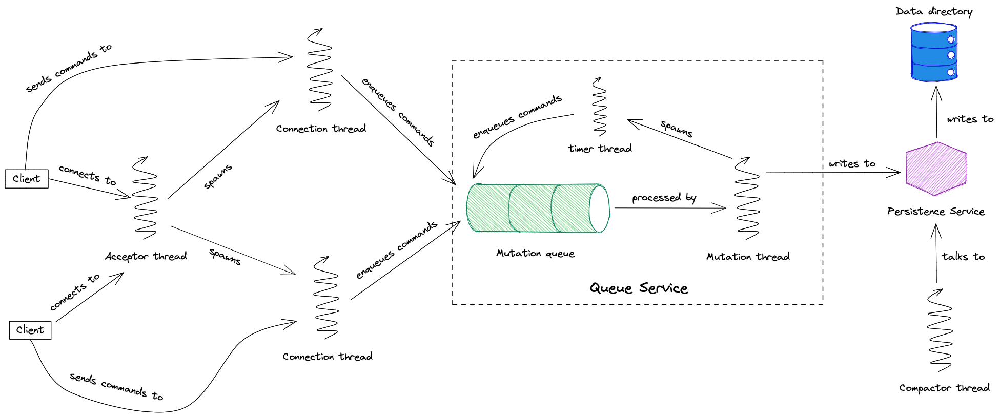

# small-stalk


[beanstalkd](https://github.com/beanstalkd/beanstalkd) rewritten in Clojure, because programming.

## Architecture


## Running
Install the [Clojure CLI](https://clojure.org/reference/deps_and_cli).  
This project requires a Project Loom preview build of the JDK. Download it [here](https://jdk.java.net/loom/).
At the time of writing, these are all major version 19. Install it and make sure your `JAVA_HOME` is set correctly.  
Then:
```bash
clj -X:main
```

## Running tests
```bash
clj -X:test
```